# 🛒 Digital Store

A modern **Full-Stack E-Commerce** web application built with **Next.js**, **React**, **MongoDB**, and **Tailwind CSS**.

This project includes a complete online digital store with a secure **Admin Dashboard** for managing products and customer orders.

---

# ✨ Features

## 👤 User Features

- User Registration
- User Login
- Authentication
- Browse Products
- Product Categories
  - 💻 Laptops
  - 📱 Mobile Phones
  - 📟 Tablets
- Product Details Page
- Shopping Cart
- Checkout
- Place Orders

---

## 🔐 Admin Dashboard

- Secure Admin Login
- Dashboard
- View Orders
- Edit Orders
- Delete Orders
- Add Products
- Edit Products
- Delete Products
- Product Image Upload

---

# 🛠️ Tech Stack

| Technology | Description |
|------------|-------------|
| Next.js 16 | React Framework |
| React 19 | UI Library |
| JavaScript | Programming Language |
| MongoDB | Database |
| Mongoose | ODM |
| Tailwind CSS | Styling |
| REST API | Backend Communication |

---

# 📁 Project Structure

```text
apps
├── frontend
└── admin

screenshots
README.md
```

---

# ⚙️ Installation

### Clone the repository

```bash
git clone https://github.com/pooriagheychivand/digital-store-nextjs.git
```

### Go to the project directory

```bash
cd digital-store-nextjs
```

### Install dependencies

```bash
npm install
```

### Create a `.env.local` file and add your MongoDB connection string.

### Run the development server

```bash
npm run dev
```

---

# 🗄️ Database

MongoDB is used for:

- Users
- Products
- Orders
- Authentication

---

# 📸 Screenshots

## 🏠 Home

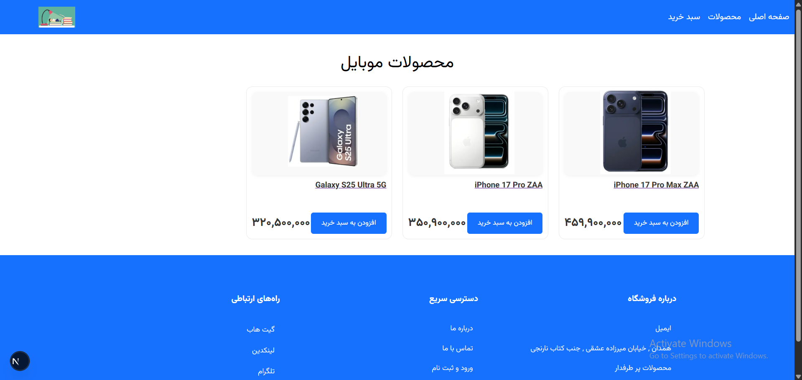

---

## 🛍 Products

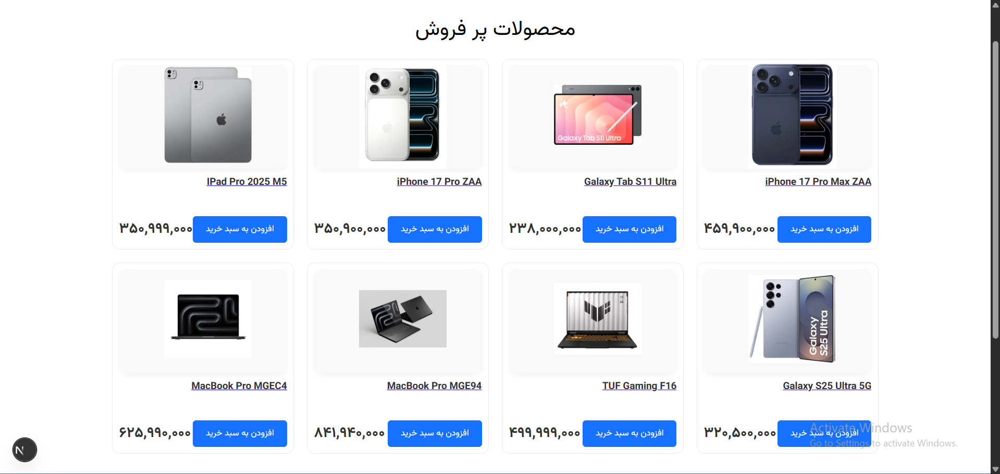

---

## 📄 Product Details

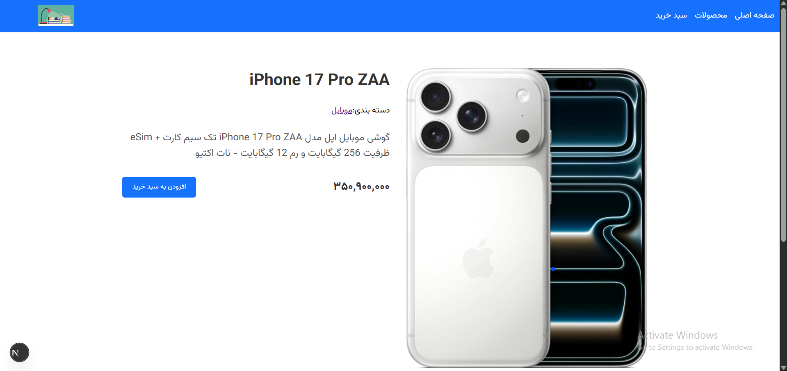

---

## 💻 Laptop Category

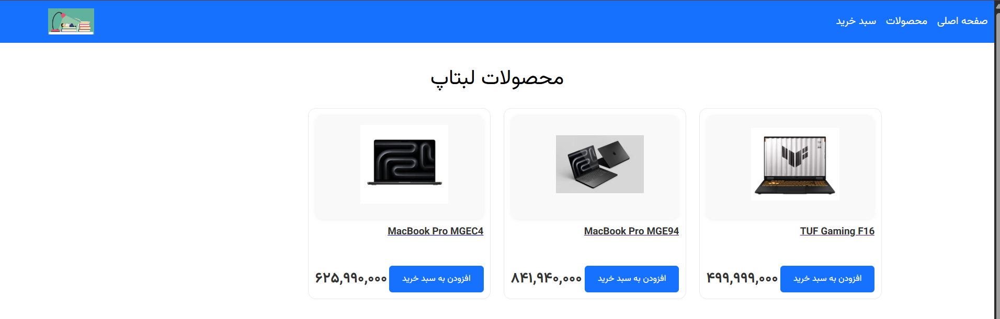

---

## 📱 Mobile Category

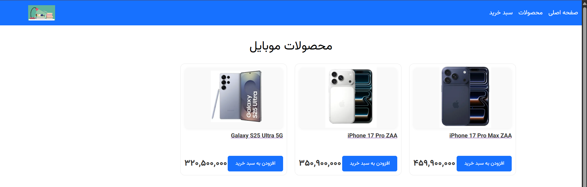

---

## 📟 Tablet Category

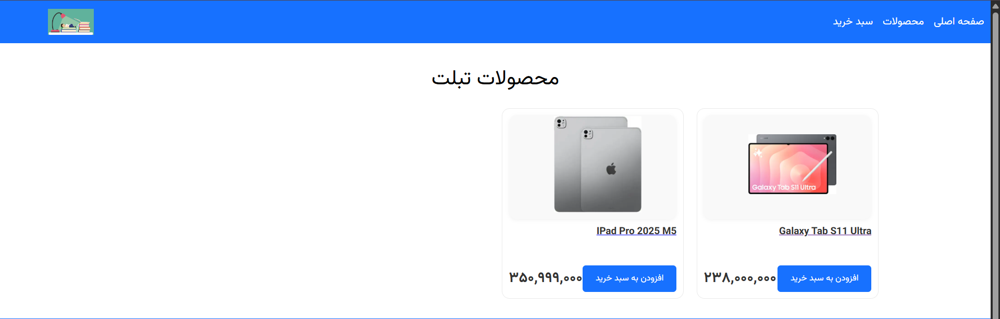

---

## 🔐 Login & Cart


---

## 📊 Admin Dashboard

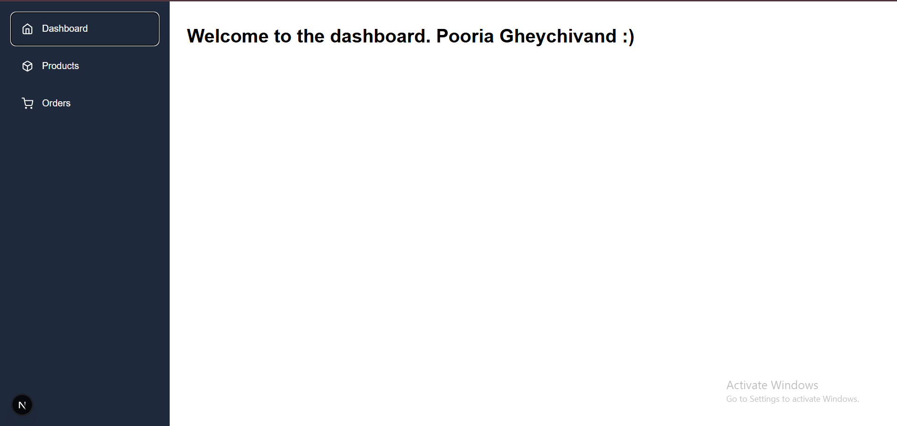

---

## 📦 Products Management

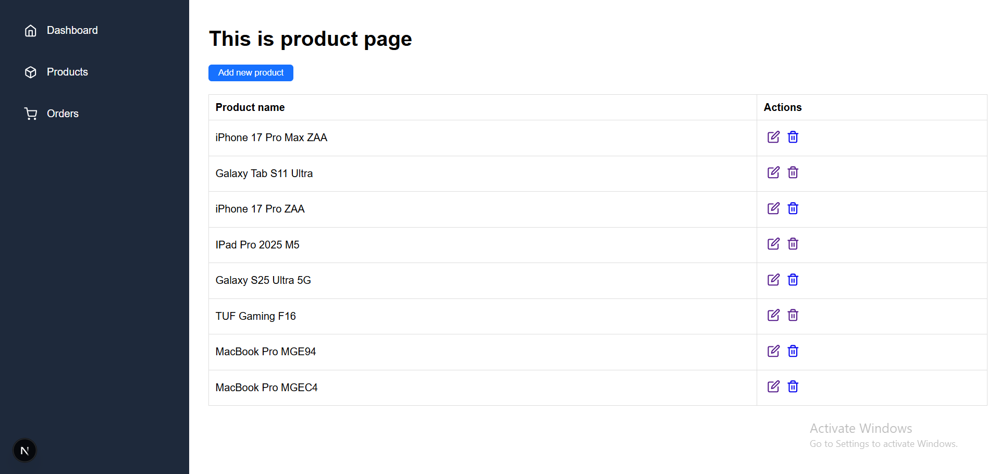

---

## 📋 Orders Management

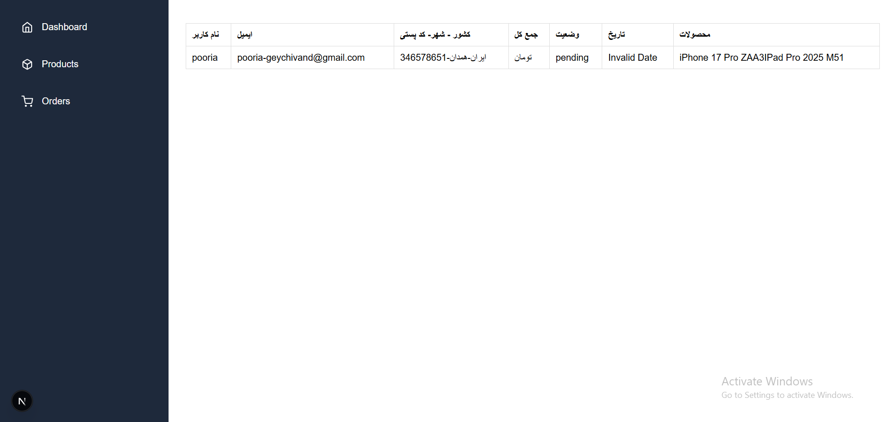

---

## ➕ Add Product

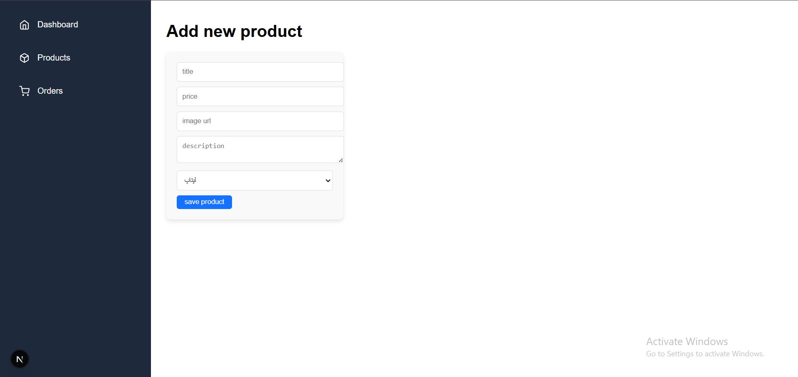

---

## ✏️ Edit Product

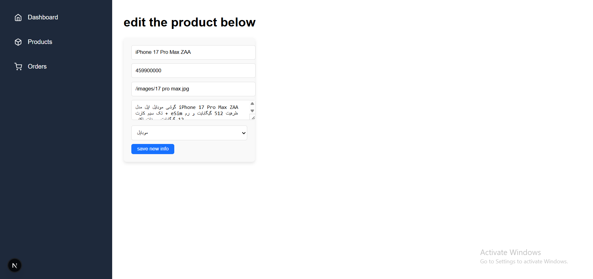

---

# 🚀 Future Improvements

- Product Search
- Product Filtering
- Payment Gateway Integration
- Wishlist
- User Profile
- Order Status Tracking
- Product Reviews

---

# 👨‍💻 Author

**Pooria Gheychivand**

GitHub:
https://github.com/pooriagheychivand

---

⭐ **If you like this project, don't forget to give it a star!**